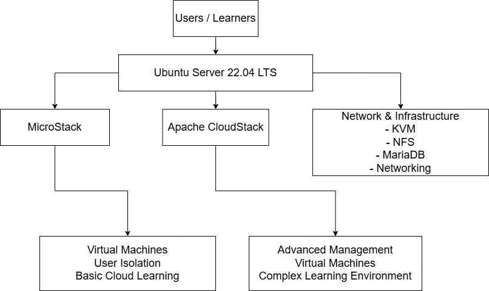

# Architecture

## Overview
This diagram presents the high-level structure of the project environment.

The architecture is based on Ubuntu Server 22.04 LTS as the core platform, with two evaluated virtualization and cloud management solutions:
- MicroStack
- Apache CloudStack

## Purpose
The goal of the architecture was to support a practical ICT learning environment where virtualization platforms could be deployed, tested, compared, and documented.

## Main Components
### Users / Learners
Represents the end users of the learning environment, such as students or trainees working with shared infrastructure.

### Ubuntu Server 22.04 LTS
Acts as the main platform foundation for the project environment and hosts the tested virtualization solutions.

### MicroStack
Represents the lighter and easier-to-deploy cloud platform used in the project for introductory and basic cloud learning scenarios.

### Apache CloudStack
Represents the more advanced cloud management platform used for deeper infrastructure administration and more complex learning scenarios.

### Network & Infrastructure
Represents the supporting technical layer required by the environment, including virtualization, storage, database, and networking components.

## Learning Perspective
The architecture supports:
- virtualization learning
- platform comparison
- user isolation
- shared infrastructure usage
- practical administration experience

## Summary
The diagram shows how the project environment was structured to compare two cloud platforms in a practical Ubuntu-based server environment.
